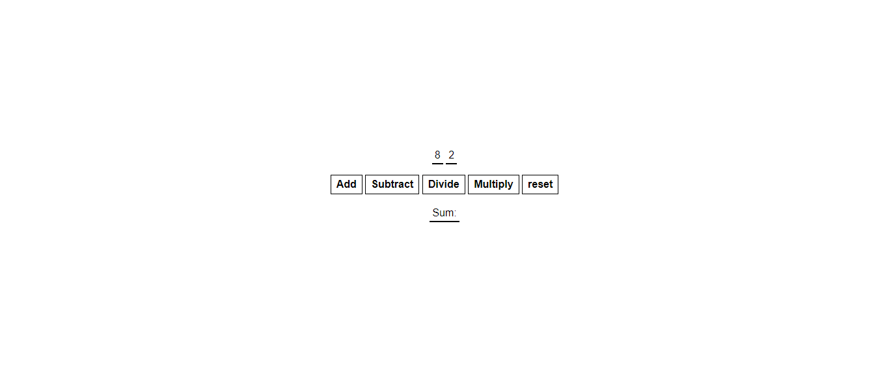

# Scrimba frontend learning Path

This is a solution to scrimba's simple calculation 

## Table of contents

- [Overview](#overview)
  - [The challenge](#the-challenge)
  - [Screenshot](#screenshot)
  - [Links](#links)
- [My process](#my-process)
  - [Built with](#built-with)
  - [Proud of this](#proud-of-this)
  - [Continued development](#continued-development)
- [Author](#author)

## Overview

### The challenge

Users should be able to:

- View the optimal layout for the site depending on their device's screen size
- Call the correct function when the user clicks on one of the buttons
- Perform the given calculation using num1 and num2
- Render the result of the calculation in the paragraph with id="sum-el"
- Clear former calculation result

### Screenshot




### Links

- Solution URL: (https://github.com/ibimina/simple-calculation)
- Live Site URL: (https://ibimina.github.io/simple-calculation/)

## My process

### Built with

- Semantic HTML5
- CSS custom properties
- Flexbox
- Mobile-first workflow

### Proud of this
I used this function to reset the calculation result 

```js
const reset = () => (showArithmetic.textContent = 'Sum: ');

```
### Continued development

Javascript and React framework


## Author

- Ibimina Hart
 - Frontend Mentor - [ibimina](https://www.frontendmentor.io/profile/ibimina)
 - Linkedin - [ibimina hart](https://www.linkedin.com/in/ibimina-hart)
- Twitter - [ibiminaaH](https://www.twitter.com/ibiminaaH)


